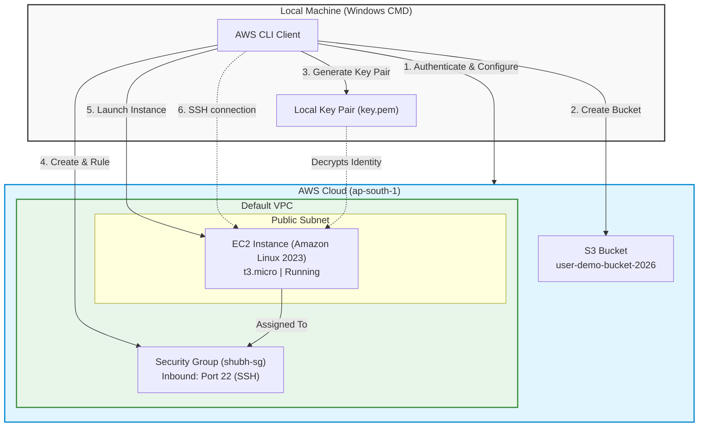

# AWS Infrastructure Provisioning Guide
> **Deploying an S3 Bucket and an EC2 Instance using AWS CLI from Windows CMD**

This guide provides a comprehensive, step-by-step walkthrough for configuring the AWS Command Line Interface (CLI), provisioning resources (including an S3 bucket, an EC2 Key Pair, a Security Group, and a subnet-integrated EC2 instance), and connecting to your instance securely—all from the Windows Command Prompt (CMD).

---

## Architecture Overview

The following diagram illustrates the deployment flow and how resources interact within your AWS environment:



---

## Prerequisites

Before you begin, make sure you have:
- An active **AWS Account**.
- **AWS CLI** installed on your Windows machine. If you don't have it, download the installer from [AWS CLI Installation Guide](https://docs.aws.amazon.com/cli/latest/userguide/getting-started-install.html).
- Proper **IAM Permissions** to manage S3, EC2, VPC, and Security Groups.

---

## Step-by-Step Deployment

### 1. Verify AWS CLI Installation
Confirm that the AWS CLI is installed and accessible from your Command Prompt.
```cmd
aws --version
```

---

### 2. Configure AWS CLI Credentials
Initialize the CLI configuration to set your credentials, preferred region, and output format.
```cmd
aws configure
```
Provide the following inputs when prompted:
```cmd
AWS Access Key ID [None]: YOUR_ACCESS_KEY
AWS Secret Access Key [None]: YOUR_SECRET_KEY
Default region name [None]: ap-south-1
Default output format [None]: json
```

---

### 3. Verify Active Configuration
Validate that your active credentials and configured default region are active.
```cmd
aws configure list
```

---

### 4. List Existing S3 Buckets
Check if you can communicate with the S3 API by listing any existing buckets.
```cmd
aws s3 ls
```

---

### 5. Create a Globally Unique S3 Bucket
Create a new S3 bucket in the `ap-south-1` region.
> [!IMPORTANT]
> S3 bucket names must be **globally unique**. Make sure to replace `user-demo-bucket-2026` with a custom name of your choice.

```cmd
aws s3api create-bucket --bucket user-demo-bucket-2026 --region ap-south-1 --create-bucket-configuration LocationConstraint=ap-south-1
```

---

### 6. Verify Bucket Creation
Confirm the bucket was successfully created.
```cmd
aws s3 ls
```

---

### 7. Create an EC2 Key Pair
Create a key pair to securely SSH into your EC2 instance and output it directly to a local PEM file.
```cmd
aws ec2 create-key-pair --key-name key --query "KeyMaterial" --output text > key.pem
```

> [!WARNING]
> On Windows CMD, redirecting output with `>` can sometimes save the file in UTF-16 encoding, which may cause SSH connection errors. If your SSH client complains about format, use a code editor (like VS Code) to convert `key.pem` to UTF-8/LF format, or configure CMD to use UTF-8 before running the command: `chcp 65001`.

---

### 8. Verify the PEM File
Confirm the `key.pem` file exists in your current directory.
```cmd
dir key.pem
```

---

### 9. Create a Security Group
Create a new Security Group to control inbound and outbound traffic for your EC2 instance.
```cmd
aws ec2 create-security-group --group-name shubh-sg --description "My EC2 security group" --region ap-south-1
```
*Note the returned **Security Group ID** (e.g., `sg-0c754*******b12`) from the JSON output; you will need it for subsequent steps.*

---

### 10. Open SSH Port (22)
Authorize inbound SSH traffic to allow connections from any IP address (`0.0.0.0/0`).
> [!WARNING]
> Opening port 22 to `0.0.0.0/0` is convenient for testing, but unsafe for production. In real-world scenarios, restrict access by replacing `0.0.0.0/0` with your specific public IP (e.g., `YOUR_IP/32`).

```cmd
aws ec2 authorize-security-group-ingress --group-id sg-0c754*******b12 --protocol tcp --port 22 --cidr 0.0.0.0/0 --region ap-south-1
```
*(Make sure to replace `sg-0c754*******b12` with your actual Security Group ID).*

---

### 11. Retrieve Available Subnets
Find a valid Subnet ID inside your default VPC where you want to launch the EC2 instance.
```cmd
aws ec2 describe-subnets --region ap-south-1 --query "Subnets[*].[SubnetId,AvailabilityZone,VpcId,MapPublicIpOnLaunch]" --output table
```
Choose a subnet from the list and copy its ID (e.g., `subnet-07ff8b*********1b4`).

---

### 12. Query the Latest Amazon Linux AMI
Retrieve the latest Amazon Linux 2023 AMI ID.
```cmd
aws ec2 describe-images --owners amazon --filters "Name=name,Values=al2023-ami-*" "Name=architecture,Values=x86_64" "Name=root-device-type,Values=ebs" --query "reverse(sort_by(Images,&CreationDate))[:5].[ImageId,CreationDate,Name]" --output table --region ap-south-1
```
Identify the latest AMI ID (e.g., `ami-05957b*********d1d`) to use in the launch command.

---

### 13. Query Free-Tier Eligible Instance Types
List available instance types that qualify for the AWS Free Tier.
```cmd
aws ec2 describe-instance-types --region ap-south-1 --filters Name=free-tier-eligible,Values=true --query "InstanceTypes[*].InstanceType" --output table
```
Select a type, such as `t3.micro` or `t2.micro` depending on your region's availability.

---

### 14. Launch the EC2 Instance
Run the instance with your configured Key Pair, Security Group, and Subnet.
```cmd
aws ec2 run-instances --image-id ami-05957b*********d1d --instance-type t3.micro --key-name key --security-group-ids sg-0c754*******b12 --subnet-id subnet-07ff8b*********1b4 --count 1 --associate-public-ip-address --region ap-south-1
```
*(Ensure all placeholder IDs are replaced with your actual AMI ID, Security Group ID, and Subnet ID).*

---

### 15. Check Instance Deployment Status
Wait a few moments, then check the state and retrieve the Public IP address of your EC2 instance.
```cmd
aws ec2 describe-instances --region ap-south-1 --query "Reservations[*].[Instances][0][*].[InstanceId,State.Name,PublicIpAddress,InstanceType,KeyName]" --output table
```

---

### 16. Connect to EC2 via SSH
Securely connect to your newly deployed Amazon Linux EC2 instance using the PEM key.
```cmd
ssh -i key.pem ec2-user@<YOUR_PUBLIC_IP>
```
*(Replace `<YOUR_PUBLIC_IP>` with the public IP address obtained in Step 15).*

> [!TIP]
> **Securing PEM file permissions on Windows:**
> If SSH fails with an "unprotected private key file" error, you must modify the permissions of your `key.pem` to restrict access:
> 1. Right-click `key.pem` -> Properties -> Security -> Advanced.
> 2. Disable inheritance and remove all existing permissions.
> 3. Add your Windows user and grant them **Full Control**.
> 
> Alternatively, execute these commands in Command Prompt:
> ```cmd
> icacls key.pem /inheritance:r
> icacls key.pem /grant:r "%username%":F
> ```

---

## Cleanup & Resource Tear-Down

To avoid incurring charges, remember to destroy all created resources once you are done experimenting.

### 1. Terminate the EC2 Instance
```cmd
aws ec2 terminate-instances --instance-ids <YOUR_INSTANCE_ID> --region ap-south-1
```

### 2. Delete the Security Group
*(Only possible after the EC2 instance has fully terminated)*
```cmd
aws ec2 delete-security-group --group-id <YOUR_SG_ID> --region ap-south-1
```

### 3. Delete the Key Pair
Remove the key pair from AWS and delete the local file.
```cmd
aws ec2 delete-key-pair --key-name key --region ap-south-1
del key.pem
```

### 4. Delete the S3 Bucket
*(Note: This command will permanently delete all objects inside the bucket before removing it)*
```cmd
aws s3 rb s3://user-demo-bucket-2026 --force
```

